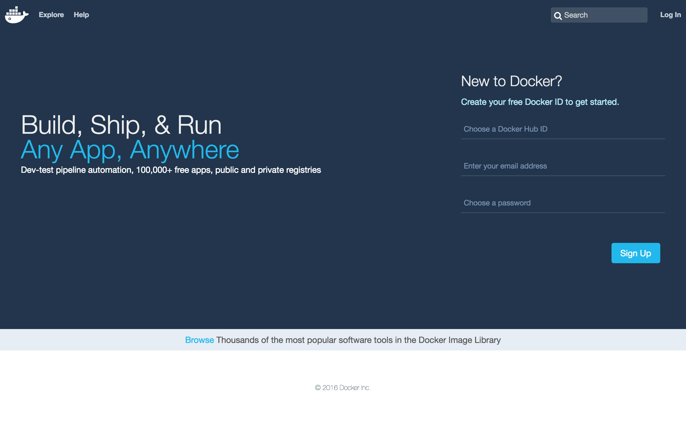
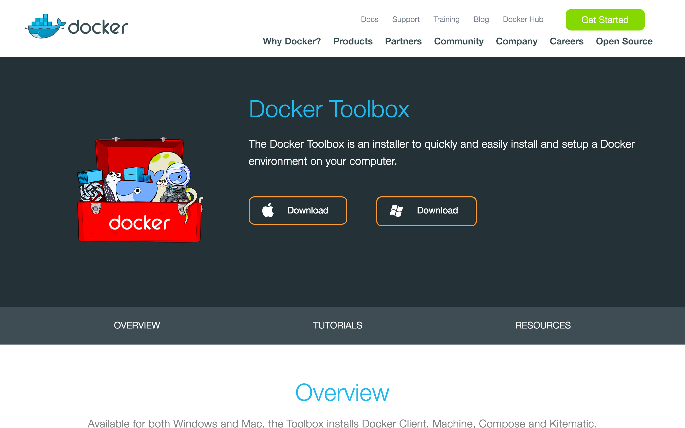
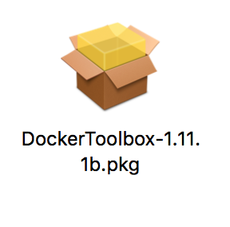
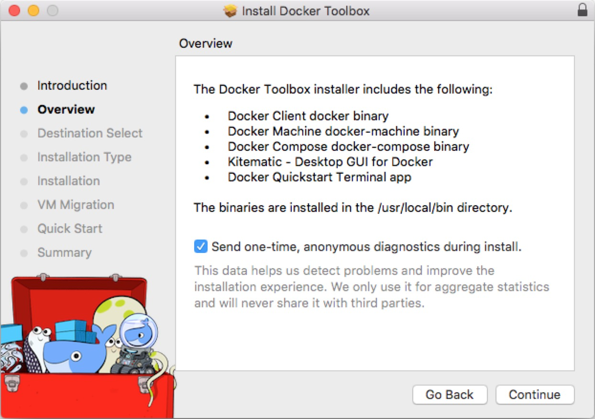
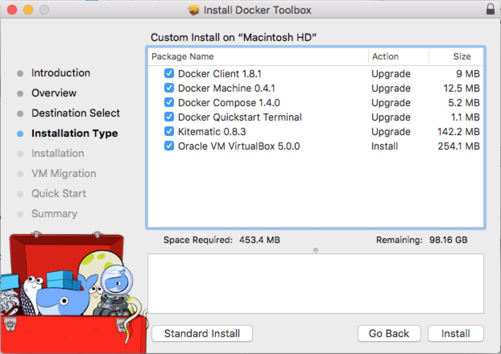
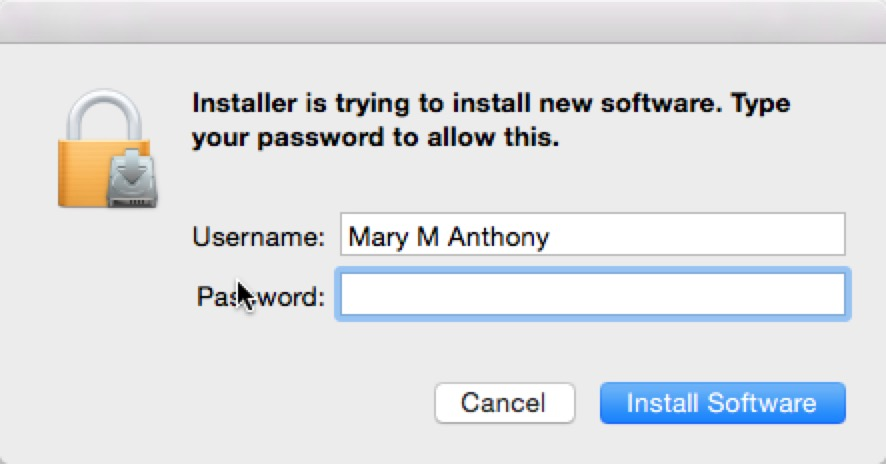
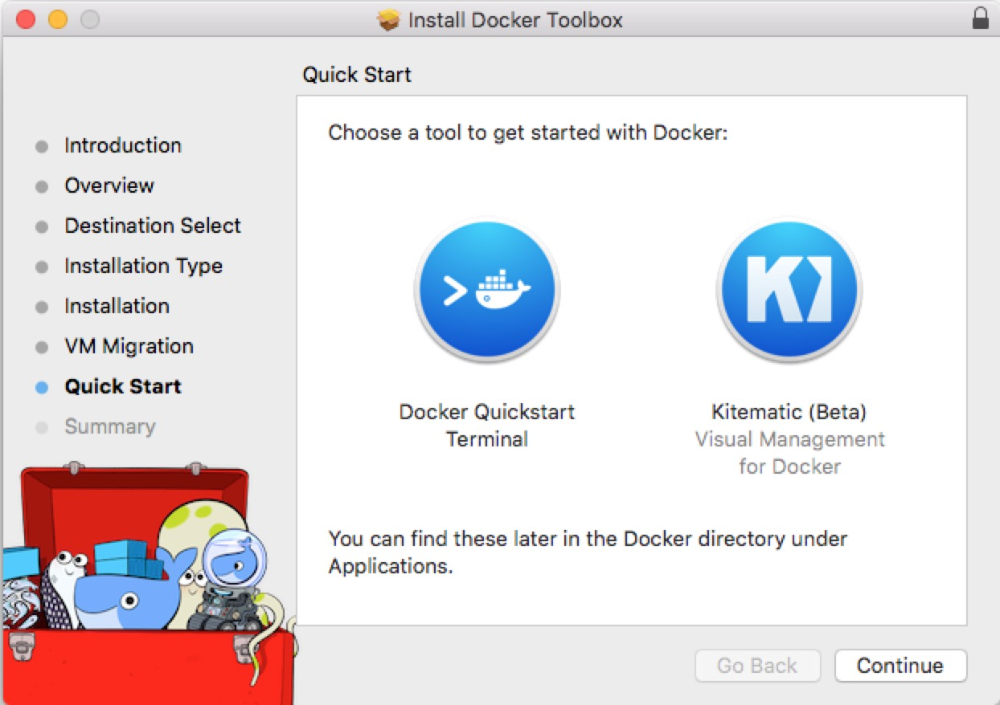
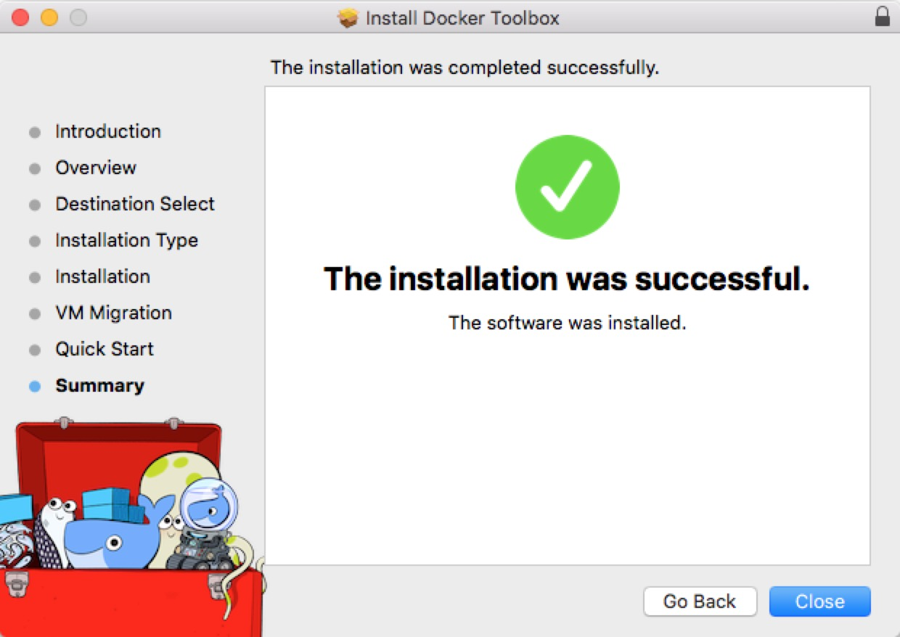

# Create-your-own-docker.io(for mac)

Docker是一个开源的引擎，可以轻松的为任何应用创建一个轻量级的、可移植的、自给自足的容器。开发者在笔记本上编译测试通过的容器可以批量地在生产环境中部署，包括VMs（虚拟机）、bare metal、OpenStack 集群和其他的基础应用平台。 

俺之前也是在mac上开虚拟机跑ubuntu.但无奈120G的硬盘不够用啊.于是折腾了下docker.

so 把自己的经历写下来.

### 第一步:先注册个docker账号吧.反正总要用到的.
**[点击这里注册账号](https://hub.docker.com/)**

### 第二步:下载docker
**[点击这里下载docker](https://www.docker.com/products/docker-toolbox)**

下载完后是这么个鬼东西

然后点击安装

需要权限

---

