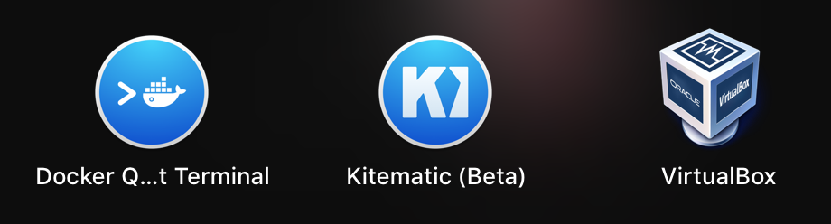
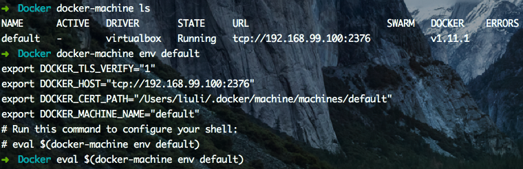

# Create-your-own-docker.io(for mac)

Docker是一个开源的引擎，可以轻松的为任何应用创建一个轻量级的、可移植的、自给自足的容器。开发者在笔记本上编译测试通过的容器可以批量地在生产环境中部署，包括VMs（虚拟机）、bare metal、OpenStack 集群和其他的基础应用平台。 

俺之前也是在mac上开虚拟机跑ubuntu.但无奈120G的硬盘不够用啊.于是折腾了下docker.

so 把自己的经历写下来.

### 第一步:先注册个docker账号吧.反正总要用到的.
**[点击这里注册账号](https://hub.docker.com/)**


### 第二步:下载docker
**[点击这里下载DockerToolbox](https://www.docker.com/products/docker-toolbox)**

官方的指南是通过下载  DockerToolbox 来安装 docker, docker-machine 和其他辅助工具.

当然你也可以炫酷的通过命令行来安装

```
brew install docker 
brew install docker-machine

```


下载完后是这么个鬼东西


然后点击安装


需要权限


下载完后会在你的applications中出现



Docker Quickstart Terminal:这个东西和下面那个东西都能在第一次启动时自动创建一个默认的虚拟机,就是default虚拟机.

Kitematic:是一款图形化界面的应用程序,可以启动停止我们的镜像容器.以及一些简单的命令.这个可以自己去看,接下来我们的操作将完全在命令行里.

VirtualBox:因为是非linux系统,所以mac需要借助VirtualBox中的linux虚拟机作为桥梁.

### 第三步:创建自己的容器(以ubuntu14.04为例)
**这是个很重要的命令,接下来它是先锋,就不需要boot2docker这个东西了.**

```
docker-machine
```

* 1.点击Docker Quickstart Terminal进去命令行,因为第一次启动已经默认创建一个虚拟机,所以不需要手动创建了.如果是命令行下载docker的:

	需要手动创建下:
	
	```
	docker-machine create --driver virtualbox default
	```

* 2.初始化环境变量

	显示宿主机需要为 default 虚拟机设置的环境变量的指令
	
	* docker-machine env default 
	
	在宿主机中设置相应的环境变量
	
	* eval $(docker-machine env default)
	
	

**警告:不设置好环境变量将无法使用 docker 命令**

* 3.接下来可以拿个hello-world来试试效果,看看能不能愉快的玩耍.
```


```

---

