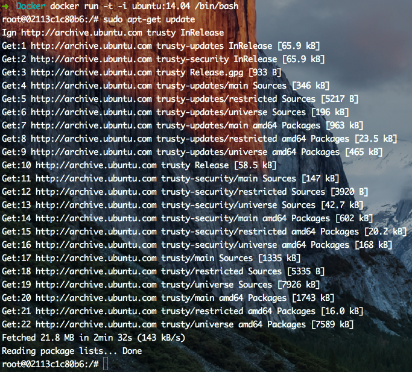

# Create-your-own-docker.io(for mac)

Docker是一个开源的引擎，可以轻松的为任何应用创建一个轻量级的、可移植的、自给自足的容器。开发者在笔记本上编译测试通过的容器可以批量地在生产环境中部署，包括VMs（虚拟机）、bare metal、OpenStack 集群和其他的基础应用平台。 

俺之前也是在mac上开虚拟机跑ubuntu.但无奈120G的硬盘不够用啊.于是折腾了下docker.


### 第一步:先注册个docker账号吧.反正总要用到的.
**[点击这里注册账号](https://hub.docker.com/)**


### 第二步:下载docker
**[点击这里下载DockerToolbox](https://www.docker.com/products/docker-toolbox)**

官方的指南是通过下载  DockerToolbox 来安装 docker, docker-machine 和其他辅助工具.

当然你也可以炫酷的通过命令行来安装

```
brew install docker 
brew install docker-machine

```


下载完后是这么个鬼东西


然后点击安装


需要权限


下载完后会在你的applications中出现


Docker Quickstart Terminal:这个东西和下面那个东西都能在第一次启动时自动创建一个默认的虚拟机,就是default虚拟机.

Kitematic:是一款图形化界面的应用程序,可以启动停止我们的镜像容器.以及一些简单的命令.这个可以自己去看,接下来我们的操作将完全在命令行里.

VirtualBox:因为是非linux系统,所以mac需要借助VirtualBox中的linux虚拟机作为桥梁.

### 第三步:先熟悉几个命令,拿nginx测试下
**这是个很重要的命令,接下来它是先锋,就不需要boot2docker这个东西了.**

```
docker-machine
```

* 1.点击Docker Quickstart Terminal进去命令行,因为第一次启动已经默认创建一个虚拟机,所以不需要手动创建了.如果是命令行下载docker的:

	需要手动创建下:
	
	```
	docker-machine create --driver virtualbox default
	```

* 2.初始化环境变量

	显示宿主机需要为 default 虚拟机设置的环境变量的指令
	
	* docker-machine env default 
	
	在宿主机中设置相应的环境变量
	
	* eval $(docker-machine env default)
	
	

**警告:不设置好环境变量将无法使用 docker 命令**

* 3.接下来可以拿个hello-world来试试效果,看看能不能愉快的玩耍.

```
docker run hello-world

```

如果看到那个Hello from Docker 就证明接下来你可以愉快的玩耍了.


	
**查看容器**

```
docker images
```	
**查看正在运行的容器**

```
docker ps -l
```
	
**删除容器(rmi与rm)**

```
docker rmi 
```
有时候这个命令并不能删除容器,所以执行docker ps -l 查看正在执行的容器.

使用docker rm (container id) 命令先删除在使用的容器.

有时候会出现错误,有可能是这个容器正在运行,那就先停止docker stop (container id)再删除.

然后在执行docker rmi命令,删除容器.
	


* 4.下载你需要的镜像,比如说拿个nginx来试试.

```
docker pull nginx
```

这一步可能会很慢,因为是访问国外的镜像库,现在国内也出现一些比较好的镜像库,下面是[阿里云镜像入口](https://dev.aliyun.com)

下拉完成后运行
```
docker run -d -P --name default nginx
```

docker run 命令启动一个容器,运行这个容器,然后退出,-d参数可以让容器在docker run命令完成之后继续在后台运行,-P参数会将容器的端口暴露给主机,这样你就可以从你的Mac访问它,--name 后面是接哪个虚拟机,default表示我们之前创建的默认虚拟机.nginx则是nginx服务

```
docker port default
```
上面命令是查看端口映射关系

```
docker-machine ip default
```
查看defalue虚拟机的ip

```
curl -I http://192.168.99.100:32773
```

先在命令行试试


在浏览器打开


O 啦.............

### 第四步:创建自己的容器(以ubuntu14.04为例)

先下载ubuntu14.04镜像
-t参数表示在容器中指定一个伪终端或终端,-i表示允许我们对容器进行交互,/bin/bash表示将在容器内启动bash shell

```
docker run -t -i ubuntu:14.04 /bin/bash
```

容器启动后你将看到这样一个命令提示符; 表示你已成功进入你的ubuntu系统,简直不要太方便,比在你的电脑上装虚拟机,然后在虚拟机里装ubuntu系统快了不是一点半点.


接下来就是完全在ubuntu系统里的操作了.

更新下apt-get.



然后在ubuntu里再下载一个nginx,原谅我如此钟爱nignx......


下载完成后修改配置文件,改端口号80为8080或者其他啥的你随便...,然后重启下nginx:

修改配置,你得下载个vim或者nano:

```
sudo apt-get install vim
```
```
sudo apt-get install nano
```


下载个curl

```
sudo apt-get install curl
```

试试效果:

```
curl -I http://localhost:8080
```


#[ubuntu配置环境可以参考这里](https://github.com/alihanniba/IDE-install-for-Ubuntu14.04)

apache.nginx 配置差别不大

**[Create-your-own-docker.io第二节](https://github.com/alihanniba/Create-your-own-docker.io/README2.md)**

---

