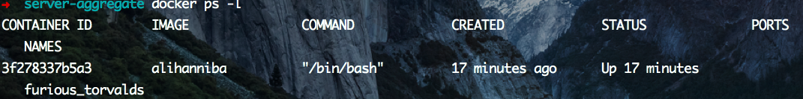

# Create-your-own-docker.io(for mac)

Docker是一个开源的引擎，可以轻松的为任何应用创建一个轻量级的、可移植的、自给自足的容器。开发者在笔记本上编译测试通过的容器可以批量地在生产环境中部署，包括VMs（虚拟机）、bare metal、OpenStack 集群和其他的基础应用平台。 

俺之前也是在mac上开虚拟机跑ubuntu.但无奈120G的硬盘不够用啊.于是折腾了下docker.


### 第五步:构建专属镜像

**在上一步中,我们已经拉了一个ubuntu系统,并在里面安装了nginx,如果你现在在终端输入exit;退出ubuntu,之后在重新进入ubuntu终端,你之前在ubuntu里做的所有操作都会重置,也就是说现在进入的相当于一个新的容器,所有东西都需要重新安装,这样子就很不爽.**

所以我们应该在修改完没有退出前commit一下,对,就相当于git的那个commit , 相当于保存你的操作.

1. 先换源,[换源链接在此](http://blog.chinaunix.net/uid-15866552-id-4994140.html),亲测搜狐的源是很不错的,推荐用搜狐的源.换完之后再Update一次
2. 在不退出容器的情况下,先
	```
	docker ps -l
	```
	
	
	
	看看当前的container id 是多少,然后就想git commit 提交一样

	```
	docker commit -m "my docker" 3f278337b5a3 alihanniba
	```
	

	
3. 然后暂停并退出ubuntu终端容器,运行docker images ,
	

4. 现在我们重新进入你刚刚命名的镜像,你可以update一下,发现请求的都是sohu的源,以此验证.

	

5. 现在你可以在你所在容器里构建你自己的环境了,然后像刚刚那样执行一遍就可以了.

#### 一次操作,方便你我他(Dockerfile)/(可跳过上面步骤)

1. 打开命令行窗口,touch Dockerfile(新建一个Dockerfile文件)

	```
	touch Dockerfile
	```

	
	

2. 打开这个文件,书写自己想要定义的东西

	```
	vim Dockerfile
	```
	你也可以
	
	```
	open .
	```
	打开文件夹用编辑器打开编辑,都可以
	
	第一行,FROM ubuntu:14.04(表示你的镜像是建立在这个镜像之上)

	```
	FROM ubuntu:14.04
	```
	
	
	接下来,你可以输入你要执行的一些操作

	先执行update,我建议这一步自己先手动去操作,因为这里执行的update是没有换源的,速度慢得神奇,可能会导致下面的RUN操作不会成功,所以我建议先手动换源,commit一个镜像,再根据这个镜像去做Dockerfile的自动定义.

	```
	RUN apt-get update
	```

	RUN 后面接的是你在ubuntu里的一些常用操作命令,可以自行定义

3. 定义保存后退出Dockerfile,通过Dockerfile来构建镜像,在终端输入docker build -t alihanniba

	```
	docker build -t alihanniba .
	```
	
	


	-t 参数为新镜像命名, . 在当前目录查找Dockerfile

### 第六步 : push镜像
* 用我们之前注册的账号登陆Docker hub

	```
	docker login
	```
	
	输入账号密码登陆,完了就可以push了 ,不过这里得注意push的镜像名字必须是你的用户名/xx,不是这个格式的得重命名,
	
	```
	docker tag alihanniba alihanniba/alihanniba
	```
	
	接下来push 

	```
	docker push alihanniba/alihanniba
	```
	
	完了后,你在你的docker hub上就能看到一条镜像记录,别人要拿你的镜像使用,直接

	```
	docker pull alihanniba/alihanniba
	```
	就可以了
	
### 以上观点纯属抛砖引玉,深入研究可学习下面几篇文章

######接下来,贴几条参考链接,包括详细管理命令,端口映射,以及在ubuntu里安装lnmp环境等等.

**[Create-your-own-docker.io第一节](https://github.com/alihanniba/Create-your-own-docker.io)**

**[删除镜像技巧](https://segmentfault.com/a/1190000004491286)**

**[docker常用管理命令](https://segmentfault.com/a/1190000000751601)**

**[开启Ubuntu的docker之旅](http://121.42.47.99/yuenshome/wordpress/?p=2915)**

---

